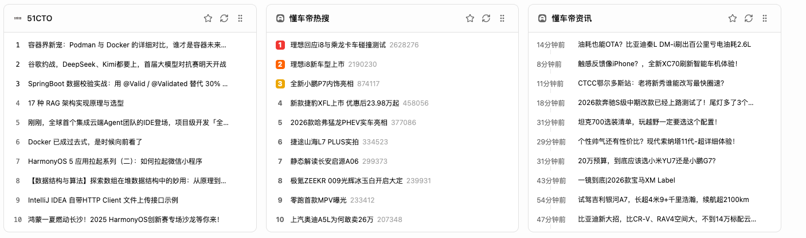
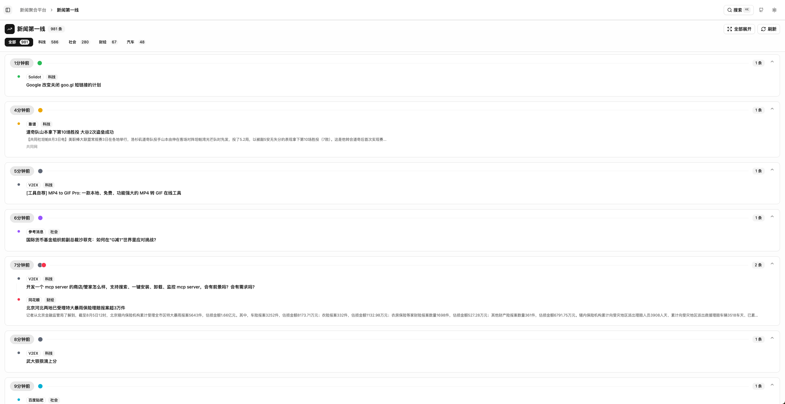
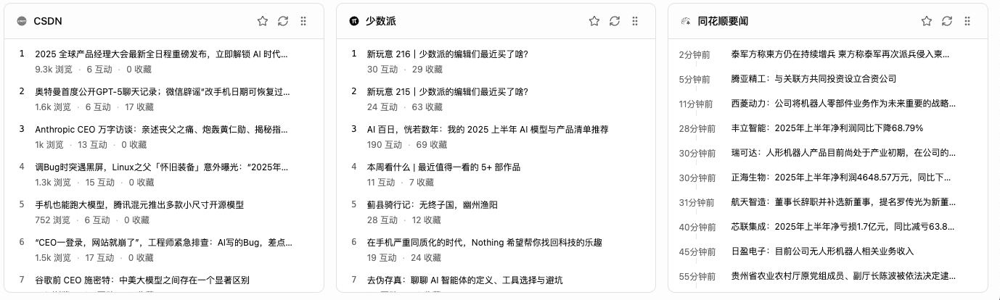
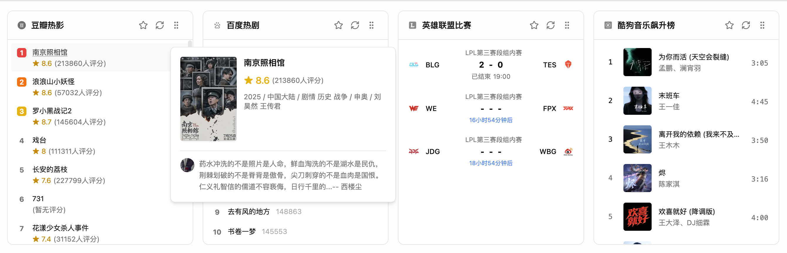
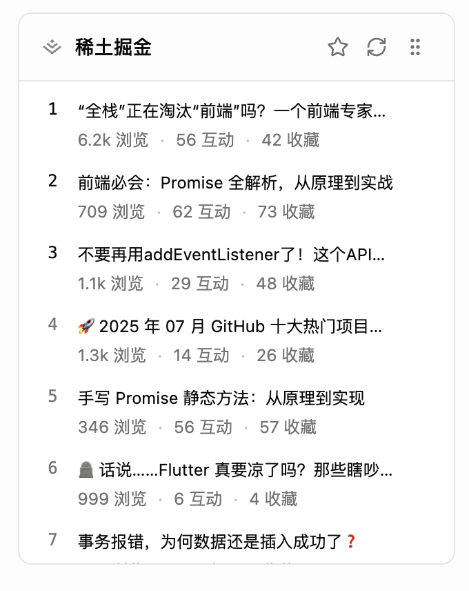

# 2025.08.25 更新记录
## 1. 新增平台
- [x] 摸鱼派
## 2. 修复已知bug
- 手机端padding异常
# 2025.08.05 更新记录
## 1. 新增平台
- [x] 51CTO
- [x] 懂车帝
  
## 2. 新增时间线

# 2025.08.04 更新记录
## 1. 新增平台
- [x] CSDN
- [x] 少数派
- [x] 同花顺要闻

# 2025.08.03 更新记录

## 1. 新增平台

- [x] 豆瓣电影
- [x] 百度热影
- [x] 百度比赛资讯(LOL)
- [x] 音乐榜单

# 2025.08.01 更新记录

## 1. 视频新增展现形式

## 2.新增平台

- [x] 稀土掘金
  

# 2025.07.31 更新记录

## 1. 修复手机端显示异常

## 2. 增加hover显示完整标题

## 3. 支持拖动排序功能

## 4. 新增平台

- [x] 酷安

# 2025.07.30 首次提交

## 1. 更新支持平台列表

- [x]  微博热搜
- [x] 百度热搜
- [x] 抖音热搜
- [x] 知乎热榜
- [x] 快手热门
- [x] GitHub趋势
- [x] V2EX最新
- [x] IT之家资讯
- [x] Solidot奇客
- [x] 36氪科技
- [x] 金十数据
- [x] 华尔街见闻
- [x] 雪球热股
- [x] 澎湃新闻
- [x] 哔哩哔哩热搜
- [x] 哔哩哔哩视频
- [x] 哔哩哔哩排行榜
- [x] 参考消息
- [x] 格隆汇
- [x] 果核剥壳
- [x] 牛客网
- [x] 远景论坛Windows
- [x] 俄罗斯卫星通讯社
- [x] 百度贴吧
- [x] 联合早报
- [x] 财联社
- [x] 靠谱

## 2. 修复部分平台的API集成

## 3. 优化响应式布局

## 4. 改进主题切换功能

## 5. 增强收藏系统功能

