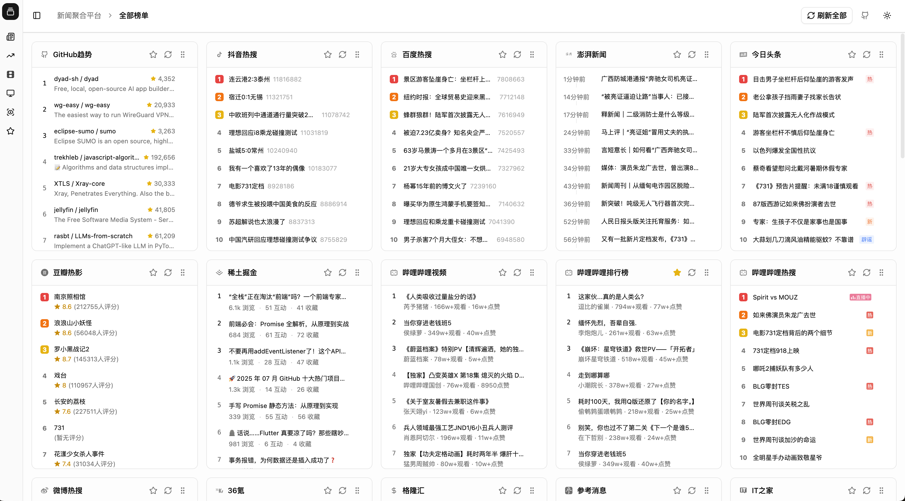
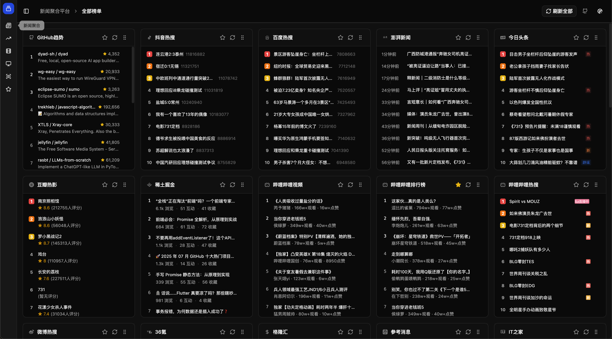

<div align="center">

<h1>
  
</h1>

**现代化新闻聚合平台**

*实时聚合多源资讯，掌握天下动态*

简体中文 | [English](./README.md)

[](https://opensource.org/licenses/MIT)
[](https://vuejs.org/)
[](https://nuxt.com/)
[](https://www.typescriptlang.org/)
[](https://vitejs.dev/)

</div>

---

## 产品截图




## 项目介绍

今日时事 是一个综合性的新闻聚合平台，整合了来自社交媒体、科技资讯、金融市场和娱乐等多个热门源的信息。采用现代化的Web技术构建，为用户提供简洁、直观的界面，让您轻松掌握全球动态。

### 核心特性

- **多平台聚合**: 集成30+平台资讯，包括微博、GitHub、豆瓣、B站等主流平台
- **智能分类**: 按科技、财经、社交媒体、娱乐、体育等领域组织内容
- **实时更新**: 实时数据同步，支持自动刷新功能
- **响应式设计**: 针对桌面端和移动端优化的浏览体验
- **主题切换**: 支持暗色/亮色主题无缝切换
- **收藏系统**: 保存和管理您喜爱的新闻源和文章
- **交互组件**: 丰富的交互元素，包括悬浮卡片和详细视图
- **拖拽排序**: 支持拖拽的可定制化卡片布局
- **搜索筛选**: 高级筛选选项，个性化内容发现

### 支持平台

#### 社交媒体与热点
- 微博热搜
- 百度热搜
- 抖音热点
- 知乎热榜
- 快手热门

#### 科技与开发
- GitHub趋势
- V2EX最新
- IT之家资讯
- Solidot奇客
- 36氪科技
- 掘金文章

#### 财经与市场
- 华尔街见闻
- 热门股票
- 金十数据
- 市场分析

#### 娱乐与媒体
- 豆瓣电影/电视
- B站热门视频
- 音乐排行榜（酷狗、QQ音乐）
- 游戏赛事（英雄联盟）

#### 新闻与资讯
- 澎湃新闻
- 参考消息
- 人民日报
- 俄罗斯卫星通讯社

## 技术栈

- **前端框架**: Vue 3 + TypeScript
- **构建工具**: Vite 6.x
- **样式方案**: TailwindCSS 4.x
- **UI组件**: Reka UI (Vue版shadcn/ui)
- **状态管理**: Vue Composition API + 类Pinia组合式函数
- **动画效果**: GSAP + TailwindCSS动画
- **图标库**: Lucide Vue Next
- **日期处理**: Day.js
- **拖拽功能**: Vue Draggable Plus
- **消息通知**: Vue Sonner

## 快速开始

### 环境要求

- Node.js 18+
- Yarn 1.22+ (推荐) 或 npm

### 安装步骤

1. **克隆仓库**
   ```bash
   git clone https://github.com/LYX9527/what-happen.git
   cd what-happen
   ```

2. **安装依赖**
   ```bash
   yarn install
   # 或
   npm install
   ```

3. **环境配置**
   ```bash
   # 复制环境变量模板
   cp .env.example .env
   
   # 配置API端点（默认：http://localhost:10010）
   VITE_API_BASE_URL=http://localhost:10010
   ```

4. **启动开发服务器**
   ```bash
   yarn dev
   # 或
   npm run dev
   ```

5. **打开浏览器**
   访问 `http://localhost:5173`

### 生产环境构建

```bash
# 构建生产版本
yarn build

# 预览生产构建
yarn preview
```

## API要求

本前端应用需要后端API服务运行在10010端口（可配置）。API应提供：

- **GET /platforms** - 可用新闻平台配置
- **GET /news** - 支持平台筛选的新闻数据

### 预期API响应格式

```typescript
interface NewsItem {
  id: string
  title: string
  url: string
  extra?: {
    info?: string
    time?: string
    rank?: number
    thumbnail?: { url: string }
    // ... 其他元数据
  }
}

interface ApiResponse<T> {
  code: number
  msg: string
  data: T
}
```

## 配置说明

### 环境变量

```bash
# API配置
VITE_API_BASE_URL=http://localhost:10010  # 后端API地址
```

### 自定义新闻源

编辑 `app/pages/dashboard/index.vue` 修改平台配置：

```typescript
const platformIcons = {
  weibo: WeiBo,
  github: Github,
  // 添加您的自定义平台
}
```

## 开发指南

### 项目结构

```
app/
├── api/           # API接口和配置
├── components/    # 可复用Vue组件
│   ├── ui/        # 基础UI组件
│   ├── NewsItems/ # 新闻项组件
│   └── icon/      # 平台图标组件
├── composables/   # Vue组合式函数
├── pages/         # 应用页面
├── router/        # Vue Router配置
└── lib/           # 工具函数
```

### 添加新闻源

1. **创建平台图标组件** 在 `app/components/icon/` 目录
2. **添加平台配置** 在dashboard中配置
3. **创建自定义新闻项组件**（如需要）在 `app/components/NewsItems/`
4. **更新API集成** 在 `app/api/news.ts` 中配置

### 组件开发规范

- 使用TypeScript确保类型安全
- 遵循Vue 3 Composition API模式
- 使用TailwindCSS实现响应式设计
- 保持与现有组件一致的样式风格

## 贡献指南

我们欢迎所有形式的贡献！请查看我们的[贡献指南](CONTRIBUTING.md)了解详情。

### 开发流程

1. Fork本仓库
2. 创建功能分支 (`git checkout -b feature/amazing-feature`)
3. 提交您的更改 (`git commit -m 'Add some amazing feature'`)
4. 推送到分支 (`git push origin feature/amazing-feature`)
5. 创建Pull Request

## 开源协议

本项目采用MIT协议 - 查看[LICENSE](LICENSE)文件了解详情。

## 技术支持

- **问题反馈**: [GitHub Issues](https://github.com/LYX9527/what-happen/issues)
- **讨论交流**: [GitHub Discussions](https://github.com/LYX9527/what-happen/discussions)

## 致谢

- 感谢所有新闻平台提供的公开API
- 使用Vue 3和现代化Web技术倾情打造
- 致力于为用户提供统一的新闻阅读体验

---

## 更新日志

### 版本 0.1.0 (当前版本)
- 首次发布，支持基础新闻聚合功能
- 支持30+新闻平台
- 响应式设计和暗色模式
- 收藏和筛选系统
- 实时更新功能

*详细更新日志请查看 [CHANGELOG.md](CHANGELOG.md)*

---

<div align="center">

**Made with ❤️ by the What Happen Team**

*保持知情，保持连接*

</div> 
