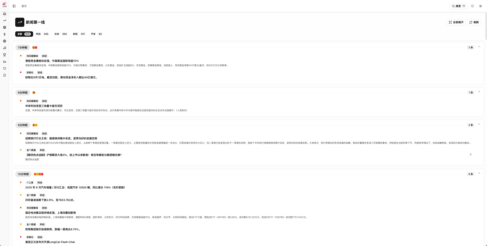

<div align="center">

<h1>
  
</h1>

**A Modern News Aggregation Platform**

*Stay informed with real-time news from multiple sources*

[简体中文](./README-zh_CN.md) | English

[](https://opensource.org/licenses/MIT)
[](https://vuejs.org/)
[](https://nuxt.com/)
[](https://www.typescriptlang.org/)
[](https://vitejs.dev/)

</div>

---

## Screenshots




## Overview

What Happen is a comprehensive news aggregation platform that brings together information from multiple popular sources including social media, tech news, financial markets, and entertainment. Built with modern web technologies, it provides a clean, intuitive interface for staying updated with what's happening around the world.

### Key Features

- **Multi-Platform Aggregation**: Integrates news from 30+ platforms including Weibo, GitHub, Douban, Bilibili, and more
- **Smart Categorization**: Organized content across Technology, Finance, Social Media, Entertainment, and Sports
- **Real-time Updates**: Live data synchronization with automatic refresh capabilities
- **Responsive Design**: Optimized for desktop and mobile viewing experiences
- **Dark/Light Theme**: Seamless theme switching for comfortable reading
- **Favorites System**: Save and organize your preferred news sources and articles
- **Interactive Components**: Rich interactive elements including hover cards and detailed views
- **Drag & Drop**: Customizable layout with draggable news cards
- **Search & Filter**: Advanced filtering options for personalized content discovery

### Supported Platforms

#### Social Media & Hot Topics
- Weibo Hot Search
- Baidu Hot Search  
- Douyin Trending
- Zhihu Hot
- Kuaishou Hot

#### Technology & Development
- GitHub Trending
- V2EX Latest
- IT Home News
- Solidot Updates
- 36Kr Tech News
- Juejin Articles

#### Finance & Markets
- Wall Street CN
- Hot Stock Updates
- JinShi Live
- Market Analysis

#### Entertainment & Media
- Douban Movies/TV
- Bilibili Hot Videos
- Music Charts (KuGou, QQ Music)
- Gaming (LOL Esports)

#### News & Information
- The Paper News
- Reference News
- People's Daily
- Sputnik News CN

## Tech Stack

- **Frontend Framework**: Vue 3 + TypeScript
- **Build Tool**: Vite 6.x
- **Styling**: TailwindCSS 4.x
- **UI Components**: Reka UI (shadcn/ui for Vue)
- **State Management**: Vue Composition API + Pinia-like composables
- **Animations**: GSAP + TailwindCSS animations
- **Icons**: Lucide Vue Next
- **Date Handling**: Day.js
- **Drag & Drop**: Vue Draggable Plus
- **Notifications**: Vue Sonner

## Quick Start

### Prerequisites

- Node.js 18+ 
- Yarn 1.22+ (recommended) or npm

### Installation

1. **Clone the repository**
   ```bash
   git clone https://github.com/LYX9527/what-happen.git
   cd what-happen
   ```

2. **Install dependencies**
   ```bash
   yarn install
   # or
   npm install
   ```

3. **Environment setup**
   ```bash
   # Copy environment template
   cp .env.example .env
   
   # Configure API endpoint (default: http://localhost:10010)
   VITE_API_BASE_URL=http://localhost:10010
   ```

4. **Start development server**
   ```bash
   yarn dev
   # or
   npm run dev
   ```

5. **Open your browser**
   Navigate to `http://localhost:5173`

### Building for Production

```bash
# Build for production
yarn build

# Preview production build
yarn preview
```

## API Requirements

This frontend application requires a backend API service running on port 10010 (configurable). The API should provide:

- **GET /platforms** - Available news platforms configuration
- **GET /news** - News data with platform filtering support

### Expected API Response Format

```typescript
interface NewsItem {
  id: string
  title: string
  url: string
  extra?: {
    info?: string
    time?: string
    rank?: number
    thumbnail?: { url: string }
    // ... additional metadata
  }
}

interface ApiResponse<T> {
  code: number
  msg: string
  data: T
}
```

## Configuration

### Environment Variables

```bash
# API Configuration
VITE_API_BASE_URL=http://localhost:10010  # Backend API URL
```

### Customizing News Sources

Edit `src/pages/dashboard/index.vue` to modify platform configurations:

```typescript
const platformIcons = {
  weibo: WeiBo,
  github: Github,
  // Add your custom platforms
}
```

## Development

### Project Structure

```
src/
├── api/           # API interfaces and configuration
├── components/    # Reusable Vue components
│   ├── ui/        # Base UI components
│   ├── NewsItems/ # News item components
│   └── icon/      # Platform icon components
├── composables/   # Vue composition functions
├── pages/         # Application pages
├── router/        # Vue Router configuration
└── lib/           # Utility functions
```

### Adding New News Sources

1. **Create platform icon component** in `src/components/icon/`
2. **Add platform configuration** in dashboard
3. **Create custom news item component** if needed in `src/components/NewsItems/`
4. **Update API integration** in `src/api/news.ts`

### Component Guidelines

- Use TypeScript for type safety
- Follow Vue 3 Composition API patterns
- Implement responsive design with TailwindCSS
- Maintain consistent styling with existing components

## Contributing

We welcome contributions! Please see our [Contributing Guidelines](CONTRIBUTING.md) for details.

### Development Workflow

1. Fork the repository
2. Create a feature branch (`git checkout -b feature/amazing-feature`)
3. Commit your changes (`git commit -m 'Add some amazing feature'`)
4. Push to the branch (`git push origin feature/amazing-feature`)
5. Open a Pull Request

## License

This project is licensed under the MIT License - see the [LICENSE](LICENSE) file for details.

## Support

- **Issues**: [GitHub Issues](https://github.com/LYX9527/what-happen/issues)
- **Discussions**: [GitHub Discussions](https://github.com/LYX9527/what-happen/discussions)

## Acknowledgments

- Thanks to all the news platforms for providing public APIs
- Built with love using Vue 3 and modern web technologies
- Inspired by the need for a unified news reading experience

---

## Changelog

### Version 0.1.0 (Current)
- Initial release with basic news aggregation
- Support for 30+ news platforms
- Responsive design and dark mode
- Favorites and filtering system
- Real-time updates

*For detailed changelog, see [CHANGELOG.md](CHANGELOG.md)*

---

<div align="center">

**Made with ❤️ by the What Happen Team**

*Stay informed, stay connected*

</div>

